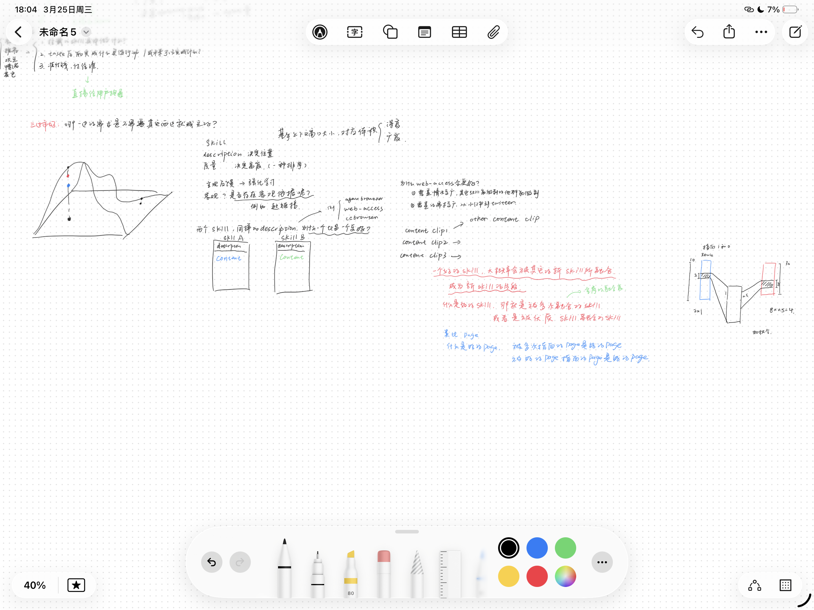

# Taste：面向大规模 Agent Skill 价值发现的云端系统设计与实现

## 使用说明

这是一份按照当前 `docs/` 目录章节结构整理的 Markdown 初稿模板，目标不是一次写完，而是先把论文骨架搭起来。

建议你的写法是：

- 先把每个小节中的“待补”内容都写成 2-5 句话
- 不确定的数据先写成“XX”
- 不确定的图表先写成“图 X.X 展示了……”
- 等整体结构稳定后，再回填实验数据、参考文献和措辞

---

## 摘要

随着大语言模型与智能体技术的快速发展，Agent Skill 生态正在经历爆发式增长。Skill 作为拓展 Agent 能力边界的核心载体，其数量的急剧膨胀带来了三个深层问题：其一，现有 Skill 分散存储于本地，Agent 在面对大量本地 Skill 时意图匹配准确率随数量增加急剧下降；其二，Skill 的安装与筛选高度依赖用户的技术认知，普通用户无从判断在特定任务场景下应安装哪些 Skill，导致 Agent 的能力上限被用户认知水平所锁死；其三，海量 Skill 之间缺乏结构化的组织与质量评估体系，高价值 Skill 难以被有效发现与复用。

针对上述问题，本文的核心工作是：**对整个 Skill 世界完成系统性建模，并将其迁移至云端。** 正如 Google 通过 PageRank 对互联网网页世界完成了结构化建模，本文提出 SkillRank 算法，对 Skill 世界进行精确建模：以 Skill 的 description（功能描述）作为语义定位坐标，将相似 description 的 Skill 归入同一竞争邻域；以 Skill 的 content（实际注入内容）构建亲缘图——被大量其他 Skill 的 content 高度相似引用的 Skill，代表被广泛认可的解法模式，应获得更高的质量分（SkillRank 分）。这一建模同时完成了 Skill 之间亲缘关系的界定，并与社区 star 数据形成可量化对比的 benchmark，使 Skill 质量首次具备客观的结构性依据。

在云端系统层面，本文设计并实现了 Taste——一个完整可用的云端 Skill 发现与使用平台。Taste 将 Skill 的发现、评估与路由能力从本地迁移至云端，带来两项根本性改变：一是 Agent 的意图匹配不再受限于本地 Skill 数量，由 Taste 统一完成语义路由，按需返回最相关的 Skill 子集；二是 Skill 的发现不再依赖用户认知，普通用户无需了解任何技术细节，Taste 自动为其 Agent 配置最合适的 Skill 组合。

在产品交互层面，Taste 提供一个基于 Skill 语义地形的可视化交互前端：用户输入当前任务 context，设定期望调用的 Skill 数量 K，系统将 K 转化为语义空间上的覆盖范围（XY 面积）与质量深度（Z 层级），在三维 Skill 地形图中实时高亮最优 Skill 区域，并输出前 K 个推荐 Skill。这一设计将抽象的建模结果转化为直观的用户体验，实现了算法价值向产品价值的完整转化。

在算法可扩展性方面，SkillRank 采用 ANN（FAISS）构建稀疏 K-NN 亲缘图，将整体复杂度控制在 O(n log n)，支持 Skill 规模从千级扩展至万级而无需全量重算。在实验验证方面，本文采用 AutoResearch 风格的 Agent 迭代优化框架，以 clawhub 平台 GitHub star 数据为 within-cluster ground truth，在 100、1000、10000 三个规模梯度上分别验证 SkillRank 的排序质量与线性可扩展性。

**关键词：** Agent Skill；Skill 建模；SkillRank；Taste；云端路由；条件排序；价值发现

---

## Abstract

With the rapid development of large language models and intelligent agents, reusable Agent Skills have become an important carrier for encapsulating tools, workflows, and domain capabilities. As the number of available skills continues to grow, users face increasing difficulty in discovering high-value skills efficiently. Existing platforms mainly rely on keyword-based retrieval or simple list presentation, and lack a systematic mechanism for large-scale skill value evaluation and ranking. As a result, high-quality skills are often difficult to identify, compare, and reuse.

The explosive growth of Agent Skills has created three deep structural problems. First, locally-stored Skills cause Agent intent-matching accuracy to collapse as the number of Skills grows — studies show accuracy drops from over 90% with fewer than 20 Skills to around 20% with 200. Second, Skill discovery and configuration depend entirely on user technical knowledge, creating a hard ceiling on what any Agent can do for non-technical users. Third, the Skill ecosystem lacks a structural quality model: without objective ranking, high-value Skills remain invisible in the noise.

The central contribution of this thesis is to systematically model the Skill world and migrate it to the cloud — analogous to how Google and PageRank structured and ranked the web. We propose the SkillRank algorithm, which models Skills along two dimensions: a Skill's description serves as its semantic coordinate (positioning it within a functional neighborhood), while its content participates in a kinship graph where Skills whose content is widely referenced by similar Skills are recognized as representing broadly-adopted solution patterns and receive higher quality scores. This framing simultaneously defines inter-Skill kinship relationships and establishes an objective quality benchmark comparable to community star ratings.

On the system side, we design and implement Taste — a complete, production-ready cloud platform for Skill discovery and usage. Cloud migration delivers two fundamental improvements: Agent intent matching is no longer constrained by local Skill count — Taste handles semantic routing and returns only the most relevant Skill subset; and Skill discovery is decoupled from user expertise — non-technical users benefit from optimal Skill configurations without any manual setup. To bridge the gap between algorithm and user value, Taste includes an interactive 3D Skill terrain visualization: users input a task context and set a target Skill count K; the system translates K into an XY coverage area and Z quality depth, highlights the optimal region on a live 3D terrain map, and returns the top K recommended Skills. This makes the abstract modeling results tangible and actionable for end users.

For scalability, SkillRank uses ANN (FAISS) to build a sparse K-NN kinship graph, keeping complexity at O(n log n) and supporting incremental updates as the Skill ecosystem grows. For experimental validation, we adopt an AutoResearch-style agent-driven iterative optimization framework: using clawhub Skills with GitHub star data as within-cluster ground truth, an agent iterates over the ranking algorithm (one variable per round) across three scale levels (100, 1,000, and 10,000 Skills), simultaneously measuring ranking quality improvement and linear scalability.

**Keywords:** Agent Skill; skill modeling; SkillRank; Taste; cloud routing; conditional ranking; value discovery

---

## 第一章 绪论

### 1.1 选题背景与意义

Actionable Agent 的出现让人类智能进入了一个新的时代转折点。以闭源的 codex，claude code，manus，和开源的 openclaw 类的通用类 agent 正在逐渐接入越来越多的系统和工具。他们的基座模型大多是编码特训模型，在训练期间存在大量的终端相关的命令行数据，而命令行，本身就是操作计算机的原语。其底座 agent loop，以 agent 为核心，接入 skill 与 mcp，tools 等工具来拓展 agent 能力的边界成为应用生态的主流。

目前 openclaw 在 github 上已有 xxx start，超越了 react 和 linux。而 skill 的生态也萌生了巨大的增长潜力，有潜力成为新时代 agentware 的必要访问方式。

人们在使用 agent 时，必不可少的就是配置各种各样的 skill 来拓展 agent 的能力边界。每一个 skill 都是一次 agent 能力的升级。但是当前 skill 应用存在许多关键性的问题

**Skill 太多，如何找到有用的那个？**

正如在互联网诞生之初，无数 page 网页，如何在海量网页中找到最有用的那个？

而由于使用 skill 的主体，不是人，而是 agent，那么问题其实会更加有趣。因为 agent 本身就有信息处理的能力，而且能力强于人类。但 agent 又受限于上下文窗口，同时意图判断随机。

Skill 太多，大量重复，质量良莠不齐，如何找到当前目标下最有用的那一个？

用更 ai 的方式去表述是：

skill 太多，agent 如何在合适的时机，充分利用海量的 skill，去提升输出的质量？

这里就涉及到一个问题，agent 的输出质量高度依赖于输入，在模型固定的情况下，输入的上下文是唯一决定输出质量的因素。

而 Skill，我的理解本质就是一个上下文注入的字典 Dict，Key 就是 Description，Value 就是 Content。大量冲突，重复的 Key 对匹配造成了困难。Value 没有验证没有价值的 rank，对选择造成了困难。

而且任何人都可以写这个字典。

人们使用这个字典的方式是在字典上撕下来几页他们自己认可的，做成一个本地的小字典。然后交给 agent 自己在需要的时候查阅字典。

人们经过研究发现，本地可用字典的页面并不是越多越好，因为 agent 查字典的功夫还不到家。2-3 页的时候对 agent 提升有帮助，但 4 页之后提升骤降。
- Skill 数量 < 20：选择准确率 > 90%
- Skill 数量 > 30：准确率开始陡降
- Skill 数量 = 200：准确率跌至约 **20%**

且本地字典依赖人类自身的维护

- 需要手动同步上游字典
- 人类在使用字典的某一页之前并没有办法确认这一页是否有用
- 且大多数人并不会编撰本地字典，不知道如何选择，也不知道如何使用。

但云端的字典理论上来说，可以解决一切字典中已经存在的问题。因为 Skill 就是 agent 的答案之书。极大的决定了 agent 的能力边界和输出质量。

如何利用好已有的 skill，是决定 agent 效用的最关键问题。

而使用 agent 的质量高度，对当前时代的每一个人，都很关键。

你花 1 个亿的 token 生成质量，不如别人用了一个好的 skill 后花 1m token 的质量。


callback 到曾经的互联网时代。Google 出现之前，大量的 page，其实更像一个图书馆。信息是非结构化的，散落在各处的。带宽有限的人类，为了尽可能的获取到优质的相关信息，于是创造出了搜索引擎，帮助自己更快的获取到更加需要的信息。

做一个对比。

agent 的带宽极大的高于人类，但是有成本。而 skill 的信息密度高于 page。skill 是一种新的信息媒介。

page 可以由创作者来评价质量，因为人类既是 page 的创作者，又是 page 的使用者。

但 skill 不一样，skill 的创作者是人类、agent，或者 both。而 skill 的使用者是 agent。

因此，是人通过判断 agent 使用 skill 的输出质量来间接评价 skill 的质量。


总结一下 Skill 的三个问题：

- 对于用户来说配置稍显繁琐，维护困难，难以评价好坏，只能依赖口碑。

- 对于 Agent 来说
  - Skill匹配时，准确率随数量增加而迅速衰减
  - Skill利用时，即便精准匹配也并无质量判断，质量判断受限于人类认知


### 1.2 国内外研究现状和相关工作

本节可以从以下几个方向展开，每个方向写 1-2 段即可：

#### 1.2.1 Agent 与 Skill 生态的发展现状

- 当前 Agent 框架、平台或社区如何组织 Skill
- Skill 的典型形式有哪些
- 生态中是否已经出现技能市场、插件市场或工作流共享平台

生态中的技能市场，clawhub，skillhub，evomap 等技能市场。

clawhub 类似早期的 Yahoo，依赖人类编撰和列表，以下载量、Github Star 数为排序指标

Skillhub 与其他类似。

EvoMap 提出了一个有别于 Skill 的新概念，但本质是在做同一件事。简单问题复杂化。尝试通过类似共产的方式共享 Agent 经验。

#### 1.2.2 信息检索与排序相关研究

待补内容：

- 传统检索系统如何处理相关性排序
- 推荐系统如何进行多特征综合评分
- 这些方法对 Skill 价值发现有什么启发

#### 1.2.3 现有平台存在的问题

参上

#### 1.2.4 本文工作的定位

充分利用 agent 与 skill 的特点。

人有需求，agent 利用 skill 满足需求。

那问题定义就是：对于人类的特定需求 Context，Taste 需要为其在海量 Skill 中选择一定数量的 skills 交给 agent，以让 agent 获得更好的输出质量，==让用户的需求得到满足==。

倒退一下，用户的需求满足，意味着 ==agent 生成了符合用户需求的内容==，无论是执行了某个工作流还是提出了某些新想法。

~~根据用户的需求 context，预测用户想要的生成结果 content，然后根据利用 skill 得到生成结果的内容相似度来作为排序依据。~~

> 用户渴了是需求，预测出用户想要点奶茶或者喝水，匹配美团奶茶外卖的 skill，因为它能满足需求。

~~不太对，比如一个润湿文章语言风格的 skill，用户的需求是精简文章，预测想要的结果 content，等等，我要是都能预测想要的结果了我直接给结果就好了，为什么还要给 skill...多此一举啊。~~

热度地图。

一张大地图，每一个需求，用语义相似度去占位。

然后每个需求点，延伸的是一个 content 的排序排位。

谁排位更高呢？

- 主观
- 客观：客观来说，其 content 相似度与其他高频需求相似度越高的山峰越高。也是一种递归。content 你可以利用其他的 content 来组合自己的 content，然后权重是传递的，先计算需求的相似度，然后再看排序。


1. 被更多 skill 使用的 skill 是好的 skill
2. 被更优质的 skill 使用的 skill 是好的 skill

被使用的含义是文本片段的相似度。类似血缘关系。



---

### 【思考过程记录】SkillRank 核心机制的推导

> 以下是对 SkillRank 核心评分机制的完整推导过程，保留思考路径供后续写作参考。

#### 起点：从 PageRank 类比出发

PageRank 的核心逻辑：
- 一个网页被越多网页链接 → 它越重要
- 一个网页被越"好"的网页链接 → 它更重要

直接类比到 Skill：
- 一个 skill 被越多 skill "引用/派生" → 它越重要
- 一个 skill 被越"好"的 skill 派生 → 它更重要

**第一个问题**：PageRank 需要显式的有向链接关系（A 链接到 B），但 clawhub 上 2w+ 个 skill 之间没有任何显式关系。

#### 第一次转换：用文本相似度替代超链接

把"链接关系"替换成"文本相似度"：

```
skill A 和 skill B 的 embedding 很相似
→ 它们之间有"隐式连接"
→ 用这个构建图，跑 PageRank
```

**问题**：相似度是无向的（A 像 B = B 像 A），但 PageRank 需要有向图。

#### 关键发现：description 和 content 是两个维度

这里出现了一个重要的区分：

```
skill = { description (Key) + content (Value) }
```

- **description**：决定"被选中"——agent 根据 description 判断是否触发这个 skill
- **content**：决定"输出质量"——真正影响 agent 输出的是 content 的内容

**山坡图模型**：
- X、Y 轴 = 需求空间（由 description 的 embedding 决定坐标）
- Z 轴（高度）= skill 的质量（由 content 决定）

在 2w 个 skill 中，description 相似的 skill 可能有几百个（XY 坐标相近），但 content 质量天差地别。用 description 相似度做 SkillRank 根本区分不了这几百个。

**结论**：SkillRank 需要分两层：
1. **XY 定位**：用 description 相似度匹配需求（已有方案）
2. **Z 排序**：用 content 质量决定高度（这才是 SkillRank 的核心问题）

#### 核心问题：content 质量如何衡量？

**亲缘派生假说**：

```
如果 skill B 的 content 和 skill A 的 content 高度相似
→ B 很可能参考了 A（或者 A 和 B 来自同一个"优质模板"）
→ 被大量其他 skill 的 content "模仿"的 skill，说明它代表了一种被广泛认可的解法模式
→ 它是好的 skill
```

这就把 PageRank 的"链接图"替换成了"content 亲缘图"：

```
PageRank：  网页 A 被网页 B 链接（显式有向）
SkillRank： skill A 的 content 被 skill B 的 content 相似（隐式无向）
```

#### 关于先后顺序的讨论

**问题**：content 相似度是无向的，但"谁影响谁"是有向的。先后顺序重要吗？

**结论**：先后顺序有价值但不是必须的。

- **不考虑先后**：得到"亲缘聚类"——一个 skill 如果有很多 content 相似的"亲戚"，说明它代表了一种被广泛认可的解法模式。这对衡量质量已经够用。
- **考虑先后**（如果有创建时间）：早创建 + 被大量相似 skill 跟随 = 更高权重；晚创建 + content 和很多早期 skill 相似 = 它是跟随者，权重较低。

**建议**：第一步先用无向的 content 相似度构建亲缘图验证框架，先后顺序作为可选增强信号后续加入。

#### 额外发现：注意力流网络（用于 skill 组合）

在讨论过程中还发现了另一个有价值的方向，虽然不直接用于 SkillRank 评分，但对**skill 组合推荐**非常有价值：

把 LLM 使用 skill 的过程想象成水流：
- 需求是水源
- skill 是管道
- 好的 skill = 水流经常经过的管道

构建有向图：对每对 skill (A, B)，计算"从 A 流向 B 的概率"：

```
P(A → B) = 相似度(A, B) × 连贯性(A, B)
```

- **相似度**：A 和 B 的 embedding 有多像
- **连贯性**：A 的"输出"能否自然地变成 B 的"输入"（例如"写代码" → "写测试"连贯性高）

这个方向的价值在于：**不是找单个好 skill，而是找好的 skill 组合**。在上下文预算有限的情况下，找到"质量密度"最高的 skill 集合。

#### 总结：两个独立但互补的机制

| 机制 | 输入 | 输出 | 用途 |
|------|------|------|------|
| **亲缘 SkillRank** | content 相似度图 | 单个 skill 的质量分 | Z 轴高度排序 |
| **注意力流网络** | description embedding + 连贯性 | skill 组合推荐 | 上下文预算内的最优 skill 集合 |

---

### 【最终设计决策】核心机制、评测方案与工程约束

> 以下是在推导过程基础上，经过深入讨论后确定的最终决策，直接指导后续实现与实验。

#### 决策一：XYZ 是教学隐喻，实际模型在高维空间中运行

"XYZ 坐标系"和"山坡图"是面向人类理解的可视化工具，不是模型本质。实际上：

- **XY 位置** = description 的 embedding 向量在高维语义空间中的位置。相似的 description 对应相近的向量，即"同一语义邻域"。降维到二维仅用于可视化。
- **Z 值（SkillRank 分）** = 在同一语义邻域内，基于 content 亲缘图计算的相对质量分。Z 不是绝对分，是**条件分**——在给定 XY 邻域下才有排序意义。
- **结论**：不同语义邻域的 skill 之间，Z 值不具备可比性。browser skill 和 git skill 不在同一个排名里。

#### 决策二：Skill 价值评估是条件排序问题，不是全局排序问题

Skill 价值评估的问题定义应该明确为：

> 给定一个语义邻域（由 description embedding 聚类得到），在该邻域内的候选 skill 集合中，按 content 质量排序。

这与传统全局排名（如按全平台 GitHub star 总数排序）有本质区别。原因：
- 全局 star 排名混合了不同语义类目的 skill，比较毫无意义
- star 是社区信号，本质上也是在"同一功能赛道"内的竞争结果
- 因此，任何评测指标也应该在**类目内部**（within-cluster）计算，而非全局计算

#### 决策三：人与 LLM 消费 skill 的方式根本不同，对应不同的优化目标

| | 人类 | LLM（Agent） |
|--|--|--|
| 消费方式 | 顺序阅读列表 | 并行处理 context 窗口内所有 skill |
| 排序敏感性 | 极强（第 1 >> 第 2） | 弱（只要在窗口内都能读到） |
| 核心约束 | 注意力带宽 | context token 预算 |
| 优化目标 | 第一个结果最好 | 选进窗口的 K 个 skill 集合整体最好 |

**结论**：SkillRank 的最终目标不是"让最好的 skill 排第一"，而是"让进入 LLM context 窗口的 K 个 skill 对任务的帮助最大"。在 LLM 能够并行处理 10 个 skill 的情况下，K=10 的集合质量比第 1 名是谁更重要。

这一差异也影响评测方式——严格的第一名准确率（P@1）不是最合适的指标，K 个 skill 集合的覆盖质量（如 NDCG@K 或 within-cluster Spearman ρ）更为合适。

#### 决策四：以 AutoResearch 风格的 Agent 迭代循环优化 SkillRank 算法

参考 Karpathy 的 AutoResearch 模式，SkillRank 的核心排序算法通过以下循环自动迭代优化：

**固定不变的部分：**
- 数据集：爬取 clawhub 上含 GitHub 链接的 skill，通过 GitHub API 获取 star 数，形成带 ground truth 的数据集
- 聚类方式：description embedding → 语义邻域分组（仅用于定义"竞争圈"）
- 评测指标：within-cluster Spearman ρ（预测排序 vs. star 排序，在类目内计算）
- 评测脚本：固定，不允许修改

**Agent 唯一可以修改的文件：**
- `ranking_algorithm.py`——定义如何从一批同语义邻域 skill 的 content 计算排序

**迭代循环：**
```
读取当前算法状态
→ 提出一个修改假设（每次只改一个变量）
→ 运行评测，得到新的 within-cluster Spearman ρ
→ 改善 → 保留；退步 → 回滚
→ 记录本轮 hypothesis + delta ρ
→ 进入下一轮
```

**算法文件中可调的变量示例：**
- content 参与计算的字段范围（全文 / 特定结构段落）
- 相似度度量方式（cosine / BM25 / 混合）
- 图构建的相似度阈值（edge 连接条件）
- ANN top-K 近邻数量 K（稀疏图密度）
- PageRank damping factor
- 是否引入 content 长度、结构复杂度等启发式辅助特征

实验结果展示 N 轮迭代中 Spearman ρ 的提升曲线，作为算法有效性的核心证据。

#### 决策五：可扩展性是硬约束，算法必须达到线性复杂度

随 skill 数量增长，算法必须保持可执行性。Naive 的全量两两相似度计算为 O(n²)，不可接受。

**解决方案：ANN + 稀疏 K-NN 图**

```
1. 所有 skill content → embedding（O(n)，一次性）
2. 用 FAISS 做 Approximate Nearest Neighbor 检索
   每个 skill 只保留 top-K 个最近邻（K=10~20）
   → 稀疏图构建：O(n log n)
3. 在稀疏图上跑 PageRank → O(n · K · iterations) ≈ O(n)
4. 新 skill 接入时：只查找其 K 个最近邻，局部更新图 → O(log n)
```

| | PageRank（网页） | SkillRank（content 亲缘） |
|--|--|--|
| 图的来源 | 超链接（天然稀疏） | content 相似度（天然稠密） |
| 稀疏化方式 | 无需处理 | ANN top-K 截断 |
| 单轮复杂度 | O(edges) | O(n · K) |
| 总复杂度 | O(n · iter) | O(n · K · iter) ≈ O(n) |
| 增量更新 | 困难 | 局部邻域更新 O(log n) |

K 值也是 AutoResearch 循环中的一个可调参数。

#### 决策六：Z 值由结构信号冷启动，由行为信号持续修正

系统需要在设计时为行为信号预留槽位，支持长期演化：

```
Z(skill, t) = α · StructuralScore      # 冷启动：content 亲缘 SkillRank
            + β · BehaviorScore(t)      # 运行时：点击、选中、留存等行为信号
            + γ · OutcomeSignal(t)      # 任务完成质量（难获取，长期目标）
```

行为信号的设计原则是**零技术门槛**——不依赖 GitHub star 等需要技术背景的操作，而是记录任何用户都会自然产生的行为：

| 信号类型 | 具体行为 | 技术门槛 |
|--------|--------|--------|
| 曝光 | skill 被检索到、被展示 | 无 |
| 选择 | 被 agent 选中使用 | 无 |
| 留存 | 用完继续用、未被替换 | 无 |
| 结果 | 用户任务完成（隐式） | 无 |

新 skill 进入时，Z = 纯结构分（cold start）。随行为数据积累，Z 逐渐被行为信号修正，类似"用基本面定价，用市场行为校正"。

---


技术角度，首先是怎么根据 context 匹配 skill，其次是怎么排序 skill，最后是怎么确保这些 skill 能被客户端的 agent 利用好以满足用户需求。就这个问题。目标是用户对最终结果满意，用户不在乎得到了哪些 skill，过程不重要了，结果重要。


将本地 skill 转移至云端，解决人类手动维护 skill 列表以及 Agent 能力受限于用户自身认知上限的问题。

> 本质是“发现”问题，人类的发现效率远低于 agent，因为人类受限于信息带宽和表达能力，而 agent 天然没有这个瓶颈。


通过中心化系统路由的方式，解决 agent 意图判断匹配不准确的问题。

> agent query，query 的是 text。agent 没必要 query key word，key word 是人类思维的局限。
> agent 可以 query 上下文，精确的描述问题、需求想要的内容希望实现的输出效果。
> skill 被拆分成了两段，description as trigger，content as info。
> 白话就是让 Taste 而非 agent 自己来匹配

通过构建 SkillRank 算法（Skill 的客观价值评估与排序机制），嵌入 Taste 系统，解决 skill 利用时输出质量的问题。

> 为什么要排序？因为人只会看列表的前几个。
> Agent 可不一样，Agent 可以全看，但会占用他们的 context 然后影响他们的输出质量。


三合一为 Taste 的云端 Skill 生产级可用的系统，目标成为每一个 agent 的默认能力引擎。

### 1.3 研究内容与目标


### 1.4 本文的主要工作与创新点

1. **明确提出 Skill 价值评估是条件排序问题。** 现有平台以全局下载量、star 数等指标排序，忽略了不同语义类目的 skill 不具可比性这一事实。本文将问题重新定义为：在语义邻域内对候选 skill 按 content 质量排序，建立了更合理的问题框架。

2. **提出基于 content 亲缘图的 SkillRank 算法。** 将 PageRank 的链接图思想迁移至 skill content 相似度图：被大量其他 skill 的 content 高度相似引用的 skill，说明其代表了被广泛认可的解法模式，应获得更高的质量分。算法在语义邻域内运行，输出条件化的 Z 轴质量分。

3. **设计了线性复杂度的可扩展方案。** 针对 content 相似度图天然稠密（O(n²)）的问题，采用 ANN（FAISS）构建稀疏 K-NN 图，将图构建复杂度降至 O(n log n)，PageRank 计算复杂度降至 O(n·K·iter) ≈ O(n)，支持新 skill 的增量接入而无需全量重算。

4. **采用 AutoResearch 风格的 Agent 迭代优化框架验证算法。** 以 clawhub 平台 GitHub star 数据作为 within-cluster ground truth，构建自动化的算法优化循环：Agent 每轮修改排序算法中的一个变量，评测 within-cluster Spearman ρ 的变化，记录迭代轨迹，展示算法收敛过程。

5. **在系统设计中预留行为信号槽位，支持冷启动后的动态修正。** Z 值初始由结构信号（content 亲缘 SkillRank）决定，随系统运行逐步融合零技术门槛的行为信号（点击、选中、留存），将社区反馈能力从技术用户扩展至普通互联网用户。

6. **设计并实现了基于 Skill 语义地形的可视化交互前端，将建模结果转化为用户可用的产品。** 用户输入任务 context 与目标 Skill 数量 K，系统自动将 K 映射为语义覆盖范围（XY 面积）与质量深度（Z 层级），在三维 Skill 地形图中实时高亮最优区域并输出前 K 个推荐 Skill，实现了从算法价值到用户价值的完整转化。

### 1.5 论文结构与章节安排

本文共分为五章，各章节安排如下：

- 第一章为绪论，介绍研究背景、相关工作、研究目标、主要工作与论文结构。
- 第二章为相关技术与需求分析，阐述 Taste 系统所依赖的关键技术，并对系统需求进行分析。
- 第三章为系统总体设计，给出系统架构、模块划分、数据流设计、数据库设计和接口设计。
- 第四章为系统实现，说明系统核心模块的实现过程，包括数据接入、特征构建、价值评估与前后端功能实现。
- 第五章为实验与总结，对系统功能和效果进行验证，并总结全文工作与未来改进方向。

---

## 第二章 相关技术与需求分析

### 2.1 相关技术基础

这一章不要写成纯科普，要为系统设计服务。每节控制在 1-2 页。

#### 2.1.1 Agent Skill 的组织方式

待补内容：

- Skill 的定义和表现形式
- Skill 元数据通常包括什么
- 为什么 Skill 适合作为被管理和排序的对象

#### 2.1.2 云端系统相关技术

待补内容：

- 你用到的后端框架、数据库、缓存、搜索或前端技术
- 这些技术为什么适合 Taste

#### 2.1.3 信息检索与排序技术

待补内容：

- 检索、过滤、排序的基本流程
- 多指标综合评分思想
- 如果你用了启发式评分或加权排序，这里提前铺垫

### 2.2 需求分析

#### 2.2.1 用户需求分析

你的用户可以先分成两类：

- 普通用户：希望快速找到适合任务的 Skill
- 平台维护者或开发者：希望管理 Skill、分析价值分布、优化展示规则

待补内容：

- 用户希望用哪些维度筛选
- 用户希望看到哪些信息来判断 Skill 值不值得使用
- 用户是否需要排序解释或详情页

#### 2.2.2 功能需求分析

可直接列为：

- Skill 数据接入与存储
- Skill 信息展示与检索
- 条件筛选与排序
- Skill 详情查看
- 价值评分计算与结果更新
- 后台管理或数据维护

#### 2.2.3 非功能需求分析

从这些角度写：

- 可扩展性：支持 Skill 数量持续增长
- 可维护性：模块职责清晰，便于后续迭代
- 可用性：查询响应较快，界面信息清晰
- 稳定性：数据更新和查询服务可靠

### 2.3 本章小结

本章围绕 Taste 系统的研究基础与需求展开分析，首先介绍了 Agent Skill、云端系统以及排序相关技术，为后续系统设计提供理论支撑；随后从用户需求、功能需求和非功能需求等角度明确了系统建设目标。上述分析为 Taste 的总体架构设计与模块实现奠定了基础。

---

## 第三章 系统总体设计

### 3.1 系统设计目标

Taste 的系统设计目标主要包括以下几个方面：

- 支持大规模 Skill 数据的统一接入与管理；
- 支持多维特征建模与综合价值评估；
- 支持面向用户查询场景的筛选、排序与详情展示；
- 保证系统架构清晰，便于后续扩展与维护。

### 3.2 系统总体架构

这里建议你画一张总架构图，然后按层次解释。

可用分层：

- 数据接入层
- 数据处理层
- 价值评估层
- 服务接口层
- 前端展示层

可直接写成：

Taste 采用分层式云端系统架构。数据接入层负责从外部平台或数据源收集 Skill 相关信息，并完成原始数据的拉取与同步；数据处理层负责元数据清洗、字段统一和特征抽取；价值评估层调用 SkillRank 算法计算 Skill 综合评分；服务接口层向前端提供查询、筛选、排序和详情访问能力；前端展示层面向最终用户提供可视化交互界面。各模块分工清晰，能够较好支撑 Skill 数据从采集到展示的完整闭环。

### 3.3 系统功能模块设计

#### 3.3.1 Skill 数据接入模块

待补内容：

- 数据来源
- 拉取频率
- 数据清洗规则
- 异常处理方式

#### 3.3.2 Skill 元数据管理模块

待补内容：

- 存哪些字段
- 如何处理标签、作者、描述、更新时间等信息
- 是否做去重和标准化

#### 3.3.3 价值评估与排序模块（SkillRank 算法核心）

本模块是 Taste 系统的核心，负责调用 SkillRank 算法计算每个 skill 在其语义邻域内的相对质量分（Z 值）。

**问题定义**

Skill 价值评估不是全局排序问题，而是条件排序问题：给定一批语义相近的 skill（由 description embedding 聚类得到），在该邻域内按 content 质量排序。不同语义邻域之间的 Z 值不具备可比性。

**算法流程**

```
Step 1: Embedding
  对所有 skill 的 content 生成 embedding 向量（O(n)）

Step 2: 稀疏 K-NN 图构建
  用 FAISS（ANN）为每个 skill 找 top-K 个 content 最相似的邻居（K=10~20）
  只保留相似度超过阈值的边，形成稀疏有向图（O(n log n)）

Step 3: SkillRank 计算
  在稀疏 content 亲缘图上运行 PageRank（O(n · K · iter)）
  PageRank 分即为该 skill 在全量 skill 中的结构质量分

Step 4: 条件排序输出
  对同一语义聚类内的 skill，按 SkillRank 分排序
  输出即为该邻域内的 Z 轴排名
```

**信号融合（Z 值的动态演化）**

系统冷启动阶段，Z 值完全由结构信号决定。随系统运行，逐步融合行为信号：

```
Z(skill, t) = α · StructuralScore      # content 亲缘 SkillRank（冷启动）
            + β · BehaviorScore(t)      # 点击、选中、留存等行为累积
            + γ · OutcomeSignal(t)      # 任务完成质量（长期目标）
```

行为信号槽位在系统设计时预留，不依赖用户的技术背景，任何互联网用户的自然行为都可以贡献信号。

**可扩展性保证**

采用 ANN + 稀疏图方案，整体复杂度 O(n log n)，新 skill 接入时仅需局部更新（O(log n)），无需全量重算。这保证了系统在 skill 数量从千级增长到万级时仍可运行。

#### 3.3.4 查询与展示模块

支持以下标准查询功能：
- 关键词搜索与标签筛选
- 按 SkillRank 分、热度、更新时间等多维排序
- Skill 详情页与关键指标展示

#### 3.3.5 Skill 地形可视化交互模块

本模块是 Taste 的核心产品界面，将 SkillRank 的抽象建模结果转化为直观的用户交互体验。

**交互设计：**

| 要素 | 说明 |
|-----|-----|
| 输入 | 用户输入任务 context（自然语言描述当前需求） |
| 参数 | 目标 Skill 数量 K（Agent context 窗口预算） |
| 映射 | K → XY 覆盖范围（语义搜索半径）+ Z 截断层级（SkillRank 分下限） |
| 输出 | 三维 Skill 地形图（实时高亮最优区域）+ 前 K 个推荐 Skill 列表 |

**可视化设计：**
- X、Y 轴：description embedding 降维后的语义坐标（PCA / UMAP 投影至二维）
- Z 轴：SkillRank 分（质量高度）
- 地形渲染：以热力图或山地形式展示 Skill 分布密度与质量分布
- 高亮区域：根据输入 context 的 embedding 定位最近的语义邻域，叠加 Z 过滤后高亮前 K 个 Skill
- 交互：可旋转、缩放三维视图，点击单个 Skill 节点查看详情

### 3.4 数据库设计

这里可以先列核心表，不需要一开始就特别细。

建议至少写这些表：

- `skills`
- `skill_tags`
- `skill_metrics`
- `skill_scores`
- `users` 或 `authors`

每张表先写“用途 + 关键字段”。

示例：

`skills` 表用于保存 Skill 的基础信息，包括 Skill 名称、描述、来源链接、作者、更新时间、分类标签和状态等字段。

### 3.5 接口设计

建议列出几个核心接口：

- 获取 Skill 列表接口
- 获取 Skill 详情接口
- 条件筛选接口
- 排序结果接口
- 评分刷新或数据同步接口

你可以用这种写法：

| 接口名称 | 请求方式 | 功能说明 |
| --- | --- | --- |
| `/api/skills` | GET | 获取 Skill 列表 |
| `/api/skills/{id}` | GET | 获取 Skill 详情 |
| `/api/skills/search` | GET | 按条件查询 Skill |
| `/api/scores/refresh` | POST | 刷新评分结果 |

### 3.6 本章小结

本章从系统目标、总体架构、功能模块、数据库设计和接口设计等方面给出了 Taste 的总体设计方案。通过分层架构和模块化设计，系统能够支持大规模 Skill 数据的接入、组织、SkillRank 评分与展示，为后续系统实现提供了结构基础。

---

## 第四章 系统实现

### 4.1 开发环境与技术栈

这里按实际情况填：

- 前端：
- 后端：
- 数据库：
- 部署环境：
- 其他关键组件：

可加一句说明选型理由。

### 4.2 Skill 数据接入实现

待补内容：

- 数据是怎么抓的或导入的
- 字段怎么清洗
- 如何入库
- 如何处理缺失值和异常值

如果你已经有代码，可以贴流程：

1. 从数据源获取 Skill 原始信息。
2. 对原始字段进行解析和标准化处理。
3. 将结果写入数据库。
4. 触发指标计算与评分更新。

### 4.3 特征构建与价值评估实现

这一节是论文核心，建议分成几个子节。

#### 4.3.1 特征设计

你可以先列这些候选特征：

- 热度特征：star、fork、下载量、浏览量
- 活跃度特征：最近更新时间、维护频率
- 内容质量特征：描述完整性、文档丰富度、示例数量
- 可复用性特征：标签规范性、参数化程度、适用场景广度
- 生态反馈特征：引用、收藏、评分、社区讨论情况

#### 4.3.2 评分规则实现

待补内容：

- 各指标如何归一化
- 权重如何设置
- 最终分数如何计算

如果你暂时没有严格实验，可以写成“基于业务经验与系统目标设定启发式权重”。

#### 4.3.3 排序结果生成

待补内容：

- 综合分数排序
- 多条件筛选后排序
- 如何保证结果可解释

### 4.4 前后端功能实现

#### 4.4.1 Skill 列表页实现

待补内容：

- 列表展示了什么字段
- 支持哪些排序和筛选方式

#### 4.4.2 Skill 详情页实现

待补内容：

- 展示基础信息
- 展示关键指标
- 展示价值评分构成或说明

#### 4.4.3 后端服务实现

待补内容：

- 查询接口
- 排序逻辑
- 数据更新任务

#### 4.4.4 Skill 地形可视化前端实现

本节描述 Taste 核心交互界面的前端实现。

**数据准备：**

前端所需的坐标数据在后端离线预计算：
1. 对所有 skill 的 description embedding 做降维（UMAP），得到每个 skill 的二维 (x, y) 坐标
2. SkillRank 分作为 z 坐标
3. 三元组 (x, y, z, skill_id, skill_name, description) 序列化后存入数据库，供前端实时查询

**核心交互流程：**

```
用户输入 context（自然语言）
  → 后端对 context 做 embedding，计算与所有 skill description 的相似度
  → 根据参数 K，确定 XY 搜索半径（覆盖前 N 个最近邻）和 Z 截断阈值
  → 返回前 K 个 skill 的坐标数据与元信息

前端接收数据
  → 渲染三维地形图（Three.js 或 Plotly 3D）
  → 高亮前 K 个 skill 节点（不同颜色/大小区分）
  → 侧栏展示前 K 个 skill 的详情列表
```

**技术选型（待确认）：**
- 三维渲染：Plotly.js（`scatter3d` 类型，开发成本低）或 Three.js（自由度高，视觉效果更好）
- 地形底图：将 skill 分布密度用 kernel density estimation 生成连续曲面，叠加在散点图下方
- 前端框架：React / Vue（待定）

**输入/输出界面：**

```
┌─────────────────────────────────────────────┐
│  Context: [帮我润色一篇英文技术文章___________] │
│  K (Skill 数量): [10] [确认]                  │
├─────────────────────────────────────────────┤
│  [三维 Skill 地形图，可旋转/缩放]              │
│   · 灰色点 = 全量 skill                      │
│   · 橙色高亮点 = 推荐的前 K 个 skill          │
│   · Z 轴高度 = SkillRank 质量分               │
├─────────────────────────────────────────────┤
│  推荐 Skill 列表：                            │
│  1. write-simply  (SkillRank: 0.91)          │
│  2. proofread     (SkillRank: 0.87)          │
│  ...                                         │
└─────────────────────────────────────────────┘
```

### 4.5 系统部署与运行流程

这里可以写：

- 系统如何部署到云端
- 服务之间如何协作
- 用户请求如何从前端流转到后端和数据库

可以补一张部署图或时序图。

### 4.6 本章小结

本章围绕 Taste 的具体工程实现展开，介绍了开发环境、数据接入流程、SkillRank 算法实现与评分计算方法，以及系统前后端核心功能的落地方式。通过这些实现工作，Taste 完成了从 Skill 数据采集到价值排序展示的完整功能闭环。

---

## 第五章 实验与总结

### 5.1 实验环境与数据集构建

#### 5.1.1 实验环境

实验在本地 MacBook 上运行，计算资源有限，因此实验规模设计需要考虑本地可执行性。

#### 5.1.2 数据集构建

数据来源为 clawhub 平台。爬取所有包含 GitHub 仓库链接的 skill，通过 GitHub API 获取对应仓库的 star 数作为 ground truth 质量信号。这批数据相对干净：

- **有 GitHub 链接** → 可获取客观的社区反馈信号（star）
- **star 数代表在该功能赛道内被社区认可的程度**

为验证算法的可扩展性，设置三个规模梯度进行实验：

| 实验规模 | Skill 数量 | 用途 |
|--------|----------|------|
| 小规模 | ~100 个 | 算法调试与快速验证 |
| 中规模 | ~1,000 个 | 主要实验，评测排序质量 |
| 大规模 | ~10,000 个 | 可扩展性验证，测试 ANN + 稀疏图方案的时间复杂度 |

三个规模梯度用于同时验证两个目标：（1）排序质量随算法迭代的提升；（2）运行时间随数据量的增长趋势（应接近线性）。

#### 5.1.3 评测指标

由于 Skill 价值评估是**条件排序问题**（只在同一语义邻域内排序有意义），评测不在全局进行，而是在每个语义聚类内部独立计算，再取加权平均。

主要指标：
- **within-cluster Spearman ρ**：预测排序与 star 排序在同一聚类内的秩相关系数，衡量整体排序一致性
- **within-cluster NDCG@K**（K=5/10）：将 star 数离散化为高/中/低三档后计算，衡量 top-K 集合的质量覆盖
- **运行时间**：不同数据规模下的图构建时间与 PageRank 计算时间，验证线性复杂度

### 5.2 SkillRank 算法的 AutoResearch 风格迭代优化实验

本实验的核心思路参考 Karpathy 提出的 AutoResearch 模式：由 Agent 自动化地提出假设、执行评测、记录结论，每轮只修改一个变量，朝着 benchmark（within-cluster Spearman ρ）持续迭代优化。

#### 5.2.1 实验设置

**固定部分（不允许修改）：**
- 数据集（含 star ground truth）
- 语义聚类方法（description embedding → K-means 聚类）
- 评测脚本与指标计算逻辑

**Agent 唯一可修改的文件：**
- `ranking_algorithm.py`——定义如何从一批同语义邻域 skill 的 content 计算 SkillRank 分

**每轮迭代流程：**
```
1. Agent 读取当前算法代码与上一轮评测结果
2. 提出一个修改假设（每次只改一个变量）
3. 修改 ranking_algorithm.py，运行评测
4. 获得新的 within-cluster Spearman ρ
5. 改善 → 保留修改；退步 → 回滚
6. 记录：hypothesis + 修改内容 + Δρ
7. 进入下一轮
```

**可调参数范围（每轮选一个）：**
- content 参与计算的字段（全文 / 特定段落 / 结构化字段）
- 相似度度量方式（cosine / BM25 / TF-IDF 加权 cosine / 混合）
- ANN top-K 近邻数 K（控制图稀疏度，同时影响复杂度）
- 图构建的相似度截断阈值
- PageRank damping factor（0.5 ~ 0.95）
- 是否引入 content 长度、结构多样性等启发式辅助特征
- 是否加入 description 与 content 之间的一致性分作为辅助信号

#### 5.2.2 实验结果

（待补）展示 N 轮迭代中 Spearman ρ 的提升曲线，标注每轮关键的 hypothesis 和对应的 Δρ。预期格式：

| 轮次 | 修改假设 | within-cluster ρ | Δρ |
|-----|--------|-----------------|-----|
| 0 | 基线（cosine 相似度，K=10，damping=0.85） | XX | — |
| 1 | 将 K 从 10 调整为 20 | XX | +XX |
| 2 | 改用 BM25 代替 cosine | XX | +XX |
| ... | ... | ... | ... |

#### 5.2.3 与 Baseline 对比

对比 SkillRank 最优版本与以下 baseline 在 within-cluster Spearman ρ 上的差异：

- **随机排序**：ρ ≈ 0，作为下界
- **content 长度排序**：最简单的启发式，用文本长度代表质量
- **全局 star 排序**（不考虑聚类）：说明为什么 within-cluster 是必要的
- **SkillRank（最优版本）**：本文方案

### 5.3 可扩展性验证实验

验证 ANN + 稀疏 K-NN 图方案在三个规模梯度下的运行时间，并与 Naive O(n²) 方案对比：

| 数据规模 | Naive 全量相似度（O(n²)） | ANN 稀疏图方案（O(n log n)） |
|--------|----------------------|--------------------------|
| 100 | XX 秒 | XX 秒 |
| 1,000 | XX 秒 | XX 秒 |
| 10,000 | XX 秒（估算或实测） | XX 秒 |

预期结果：Naive 方案在 10,000 规模下不可接受；ANN 方案保持接近线性增长。

### 5.4 案例分析

（待补）从中规模数据集中，选取 2-3 个语义聚类，每个聚类内展示：
- SkillRank 排名前 5 的 skill 与对应 star 数
- 排名与 star 的吻合情况与偏差案例分析
- 偏差原因探讨（如新发布 skill star 数少但 content 质量高，说明结构信号的冷启动优势）

### 5.5 系统不足与改进方向

- **Ground truth 局限**：GitHub star 仅覆盖有开源仓库的 skill，平台原生 skill 无法纳入评测；star 有认知门槛，非技术用户无法贡献信号。后续应接入行为信号（点击、使用、留存）作为更民主化的 ground truth。
- **冷启动精度上限**：纯结构信号（content 亲缘图）在 star 数较少的长尾 skill 上预测精度有限，需要行为信号介入才能校正。
- **聚类粒度敏感性**：语义聚类的粒度（K-means 的 K 值）直接影响”竞争圈”的定义，当前实验使用固定 K，后续可探索自适应聚类粒度。
- **K 集合质量未直接评测**：当前评测关注排序相关性，但 LLM 实际消费的是 K 个 skill 的集合，集合级别的任务完成质量评测留作未来工作。

### 5.6 全文总结

本文围绕大规模 Agent Skill 场景下的价值发现问题，设计并实现了云端系统 Taste。核心贡献在于：将 Skill 价值评估定义为条件排序问题（在语义邻域内排序而非全局排序），提出基于 content 亲缘图的 SkillRank 算法（类 PageRank 结构应用于 skill content 相似度图，是 Taste 系统的核心排序引擎），并设计了 ANN + 稀疏 K-NN 图方案保证线性可扩展性。实验采用 AutoResearch 风格的 Agent 迭代优化框架，以 clawhub 平台 GitHub star 数据作为 within-cluster ground truth，验证了 SkillRank 结构信号对 skill 质量排序的有效性。

系统在设计上预留了行为信号槽位，支持从冷启动结构分逐步融合点击、使用、留存等零门槛行为信号，为未来向非技术用户群体扩展奠定了基础。

---

## 参考文献待补建议

你后面补文献时，优先找这几类：

- Agent / LLM Agent / Tool Use 相关论文
- Plugin / Skill / Workflow / Marketplace 相关平台资料
- 信息检索、排序、推荐系统基础文献
- 软件资产复用、开源生态评估相关文献

建议先凑出 15-20 篇，再逐步筛。

---

## 附录待补建议

如果正文放不下，可以把这些放附录：

- 数据库表结构明细
- 核心接口示例
- 评分公式细节
- 系统页面截图
- 数据样例

---

## 今日写作顺序建议

如果你今天就要出一版初稿，按这个顺序写最快：

1. 先把第一章全部补完
2. 再写第三章系统设计
3. 再写第四章系统实现
4. 最后补摘要和第五章

只要你先把这四部分写顺，今晚就能有一份完整可扩展的初稿。
